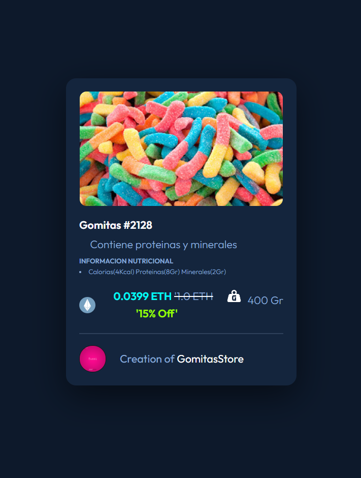
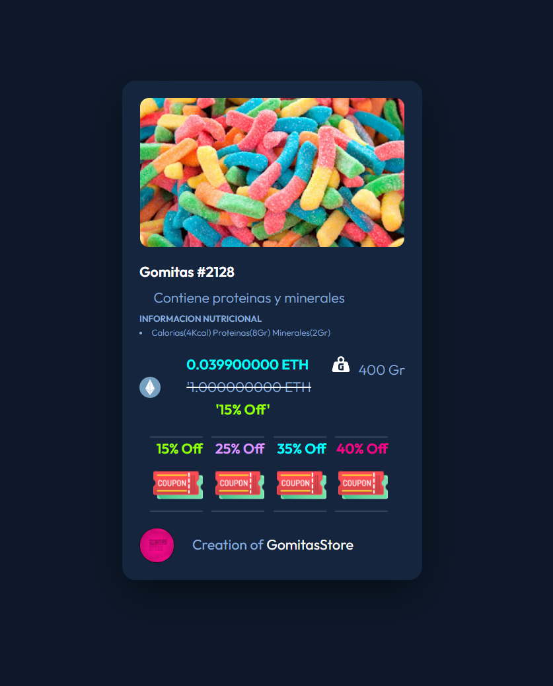

## Taller $1: Figuras Geometricas
    -1: Definir las formulas.
    -2: Implementar las formulas en Js.
    -3: Crear funciones.
    -4: Integrar JS con HTML.

## Taller $2: Porcentajes 
    -1: Definir las formulas.
    -2: Implementar las formulas.
    -3: Crear funciones.
    -4: Integrar JS con HTML.

#### 
    
## Taller $3: Demo Card 
    -1: Definir las formulas.
    -2: Implementar las formulas.
    -3: Crear funciones.
    -4: Integrar JS con HTML.
#### 

## Taller $4: Demo Card Price Functional
#### 
